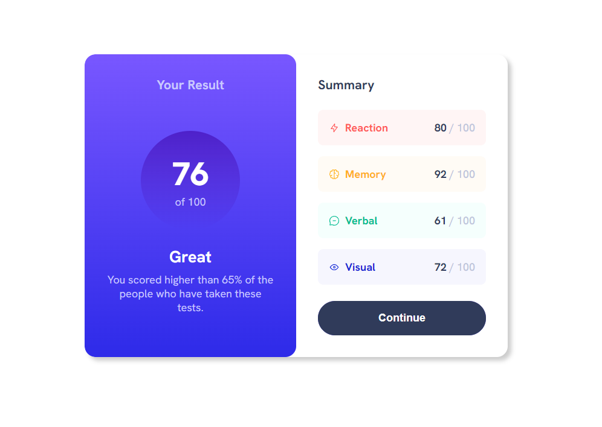
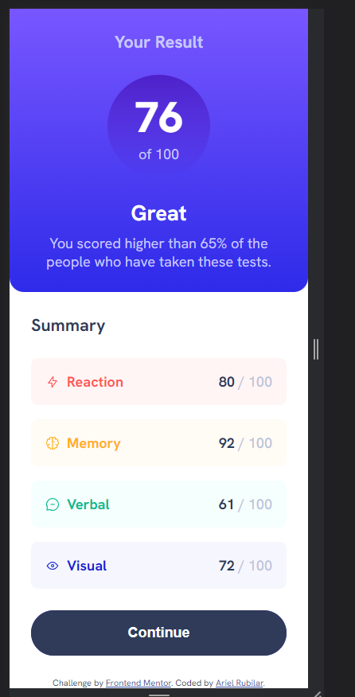

# Frontend Mentor - Results summary component solution

This is a solution to the [Results summary component challenge on Frontend Mentor](https://www.frontendmentor.io/challenges/results-summary-component-CE_K6s0maV). Frontend Mentor challenges help you improve your coding skills by building realistic projects. 

## Table of contents

- [Overview](#overview)
  - [The challenge](#the-challenge)
  - [Screenshot](#screenshot)
  - [Links](#links)
- [My process](#my-process)
  - [Built with](#built-with)
  - [What I learned](#what-i-learned)
  - [Continued development](#continued-development)
  - [Useful resources](#useful-resources)
- [Author](#author)
- [Acknowledgments](#acknowledgments)

**Note: Delete this note and update the table of contents based on what sections you keep.**

## Overview

### The challenge

Users should be able to:

- View the optimal layout for the interface depending on their device's screen size
- See hover and focus states for all interactive elements on the page

### Screenshot


#### Desktop


#### Mobile


### Links

- Solution URL: [Add solution URL here](https://github.com/ArielRubilar/frontend-mementor-result-summary-component-main)
- Live Site URL: [Add live site URL here](https://arielrubilar.github.io/frontend-mementor-result-summary-component-main/)

## My process

### Built with

- Semantic HTML5 markup
- CSS
- Flexbox
- CSS Grid
- Mobile-first workflow

### What I learned

How to add Font Face

```css
@font-face {  
  font-family: "Hanken Grotesk";
  src: local("Hanken Grotesk"),
  url("./assets/fonts/HankenGrotesk-VariableFont_wght.ttf");
  font-weight: 500 700 800;
}
```
### Continued development


### Useful resources

## Author

- Frontend Mentor - [@ArielRubilar](https://www.frontendmentor.io/profile/ArielRubilar)

## Acknowledgments
